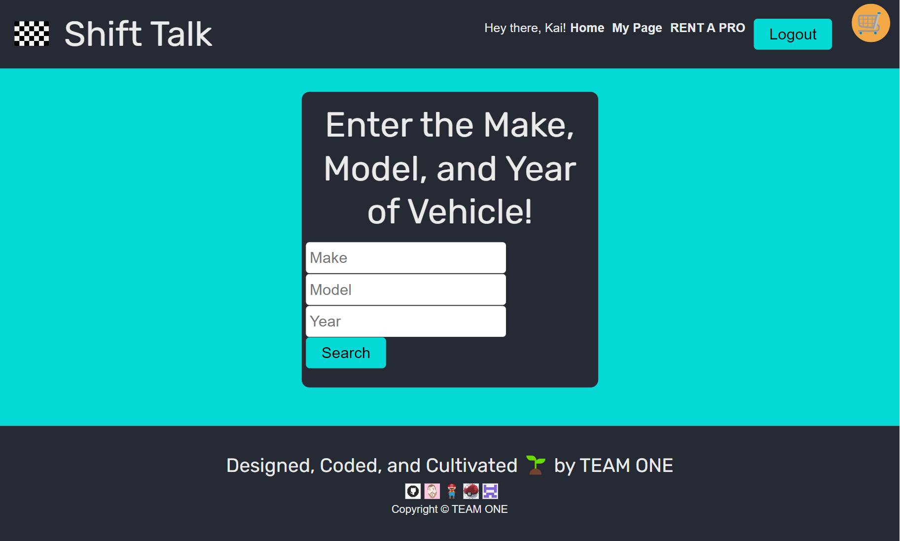

# 🏁 SHIFT 🗣️ TALK [](./LICENSE)

**Shift Talk** is a automobile enthusiasts social website where a user can create an account, login, and post about about their favorite or _least_ favorite cars. The user can also view other users posts and comment on them. The user can also delete their own posts and comments.

**Shift Talk** also offers a _Pro Shop_ where a registered user can purchase merchandise, donate, or hire a Pro. The user can also view their order history.

This app is also deployed on [Heroku](https://https://t1p3-4fd94440c532.herokuapp.com//) as [](https://t1p3-4fd94440c532.herokuapp.com/)

## Table of Contents

- [Description](#description)
- [Tech Stack](#tech-stack)
- [Installation](#installation)
- [Usage](#usage)
  - [Stripe](#stripe-test)
- [Screenshots](#screenshots)
- [Links](#links)
  - [TEAM ONE](#team-one)
- [License](#license)

## Description

```javascript
AS AN automobile enthusiast,
I WANT a dedicated social media platform where I can discuss, share thoughts, and address issues related to cars,
SO THAT I can engage with like-minded individuals and have the option to hire professionals for assistance.
```

[_back to top_](#table-of-contents)

## Tech Stack

- [](https://developer.mozilla.org/en-US/docs/Web/CSS)
- [](https://developer.mozilla.org/en-US/docs/Web/Guide/HTML/HTML5)
- [](https://developer.mozilla.org/en-US/docs/Web/JavaScript)
- [](https://nodejs.org/en/)
  - [](https://www.npmjs.com/package/concurrently)
  - [](https://www.npmjs.com/package/nodemon)
- [](https://expressjs.com/)
- [](https://www.mongodb.com/)
  - [](https://mongoosejs.com/)
- [](https://graphql.org/)
  - [](https://www.apollographql.com/docs/apollo-server/)
- [](https://www.npmjs.com/package/bcrypt)
- [](https://www.npmjs.com/package/jsonwebtoken)
  - [](https://www.npmjs.com/package/jwt-decode)
- [](https://reactjs.org/)
  - [](https://reactjs.org/)
  - [](https://reactrouter.com/)
  - [](https://www.apollographql.com/docs/react/)
- [](https://vitejs.dev/)
  - [](https://vitejs.dev/)
- [](https://stripe.com/)
  - [](https://stripe.com/docs/js)
- [](https://redux.js.org/)
  - [](https://redux-toolkit.js.org/)
  - [](https://react-redux.js.org/)

[_back to top_](#table-of-contents)

## Installation

1. Packages to support this application can be installed by using [_npm install_](https://docs.npmjs.com/cli/v9/commands/npm-install) commands.

   > **Note**: If you do not have a `package.json` in your directory already, enter command below to [_initiate_](https://docs.npmjs.com/cli/v9/commands/npm-init).
   >
   > ```powershell
   > npm init -y
   > ```

2. **Important**: Please @ the **EXACT** versions as shown above to ensure the functionality of this application.

   - Main Project:

     ```powershell
     npm i concurrently@5.1.0 --save-dev
     ```

   - Server:

     ```powershell
     npm i @apollo/server@4.9.3 bcrypt@5.1.1 express@4.18.2 graphql@16.8.1 jsonwebtoken@9.0.2 mongoose@7.5.3 stripe@13.8.0
     &&
     npm i nodemon@3.0.1 --save-dev
     ```

   - Client:

     ```powershell
     npm i @apollo/client@3.8.4 @stripe/stripe-js@2.1.7 @testing-library/react@14.0.0 graphql@16.8.1 happy-dom@12.6.0 jwt-decode@3.1.2 react@18.2.0 react-dom@18.2.0 react-router-dom@6.16.0 vitest@0.34.6 @reduxjs/toolkit@1.9.6 react-redux@8.1.3
     &&
     npm i @types/react@18.2.24 @types/react-dom@18.2.8 @vitejs/plugin-react@4.1.0 eslint@8.50.0 eslint-plugin-react@7.33.2 eslint-plugin-react-hooks@4.6.0 eslint-plugin-react-refresh@0.4.3 vite@4.4.9 --save-dev
     ```

3. **Config**: Please add the correct environmental variables in the `.env` file in the `server` directory like the example below:

   > Deploying to Heroku you will need to add these environmental variables to the Heroku Config Vars as well.

   ```javascript
   MONGODB_URI=mongodb+srv://<username>:<password>@<cluster-name>.mongodb.net/<collection-name>;
   SECRET=<SECRET-TO-JWT>;
   STRIPE_SECRET_KEY=<Your_own_test_key_or_use_this_one:sk_test_4eC39HqLyjWDarjtT1zdp7dc>;
   ```

   If you've decided to use the default `stripe secret key` then please use the matching `publishable key` in the frontend below:

   ```javascript
   const stripePromise = loadStripe('pk_test_TYooMQauvdEDq54NiTphI7jx');
   ```

4. **`npm run build && npm run preview`**: Please run the following command in the `ROOT` directory to build and preview the application for production.

   ```powershell
   npm run build && npm run preview
   ```

[_back to top_](#table-of-contents)

## Usage

- This application can be invoked locally by using the following command:

  ```powershell
  npm run preview
  ```

- App Flow:

  ```javascript
  GIVEN the Shift Talk platform for automobile enthusiasts
  WHEN I first visit the site
  THEN I see HOME, Login, Signup on the navbar and a search bar for cars.

  WHEN I search for a car using make, model, and year and hit Search
  THEN I see an Add Comment button, the ability to view existing comments, or a message incentivizing to be the first to comment.

  WHEN I click on Add Comment while logged out
  THEN I receive a warning to log in first.
  WHEN I click on Add Comment while logged in
  THEN I can submit my comment which gets added and the page refreshes with updated comments.

  WHEN I view existing comments
  THEN I see a View Replies and Reply button for each comment.

  WHEN I click on View Replies
  THEN I see all the replies within that comment.
  WHEN I click on Reply and am not logged in
  THEN I receive a warning to log in.
  WHEN I click on Reply and am logged in
  THEN I can submit my reply and the page refreshes with updated replies.

  WHEN I successfully sign up or log in
  THEN I am redirected to the home page with a personalized greeting and additional navbar options like My Page, RENT A PRO, Logout, and Cart.

  WHEN I navigate to My Page
  THEN I see options to Update Profile, View Orders, and view my comments and replies with options to delete them.

  WHEN I navigate to RENT A PRO
  THEN I see product categories and related products which I can add to my cart or view in detail.

  WHEN I navigate to a specific detail of product
  THEN I see product details with options to Add to Cart or Remove from Cart.

  WHEN I decide to checkout
  THEN I am redirected to a secure Stripe payment link.
  AFTER a successful transaction on Stripe
  THEN I am redirected back to Success page and subsequently to my View Orders.

  WHEN I am done with the platform
  THEN I can securely log out.
  ```

### Stripe Test

If you would like to test the stripe payment, feel free to use the following [testing credit card numbers](https://stripe.com/docs/testing?testing-method=card-numbers) provided by [Stripe Docs](https://stripe.com/docs) with any future date and any 3 digit CVC code (4 for American Express).


## Screenshots



## Links

[](https://twitter.com/intent/tweet?text=Check%20out%20this%20Shift%20Talk%20App%20on%20Heroku:%20https://t1p3-4fd94440c532.herokuapp.com/)

- GitHub Repo : [](https://github.com/Ronin1702/project3)

- Heroku Deployed Link : [](https://t1p3-4fd94440c532.herokuapp.com/)

### TEAM ONE

- [](https://ceresmarkley.github.io/ceres-react-portfolio/#/)
  [](https://github.com/ceresmarkley/)

- [](https://portfolio-jianxiong.netlify.app/)
  [](https://github.com/CQlove)

- [](https://ornate-faloodeh-6a725d.netlify.app/)
  [](https://github.com/IVignollesJeong)

- [](https://kaichen.biz/)
  [](https://github.com/ronin1702)

[_back to top_](#table-of-contents)

## License

- This application is licensed by [](./LICENSE).

[_back to top_](#table-of-contents)

---

[](https://github.com/orgs/Team-ONE-OSU/repositories)
